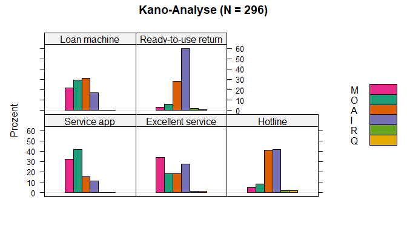
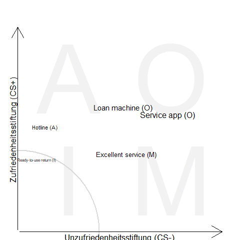

Kano Analyse
================
Wolfgang Peter
2024-05-11

Die Kano-Methode ist eine Mehr-Faktor-Analyse der Kundenzufriedenheit.
Das Kano-Modell wurde von Noriaki Kano in den 70ern fuer die Firma
Konica (Minolta Kameras) entwickelt. Die Marketingabteilung stellte
damals fest, dass Kunden bei einer direkten Befragung nur geringfuegige
Aenderungen am Produkt wuenschten. Ein tief greifendes Verstaendnis der
unausgesprochenen Beduerfnisse des Kunden konnte nicht abgeleitet
werden. Kano entwickelte daraufhin eine Methode die Wuensche und
Erwartungen von Kunden zu erfassen.

<!-- badges: start -->

<!-- badges: end -->

## Kano Fragebogen

Das Kano-Modell unterscheidet vier Ebenen der Qualitaet der
Kundenzufriedenheit:

- **M** Basis-Merkmale, selbstverstaendlich Eigenschaft (Must-be)
- **O** Leistungs-Merkmale, bewusste Eigenschaften (One-dimensional)
- **A** Begeisterungs-Merkmale, nutzen stiftende Merkmale (Attractive)
- **I** Unerhebliche Merkmale (Indifferent)

Der Kano-Fragebogen besteht aus zwei hypothetischen Fragen, die
funktionale Frage und die dysfunktionale Frage. Fuer die Beantwortung
steht eine sechsteilige Antwortskala bzw. eine dreiteilige modifizierte
Antwortskala zur Verfuegung. Die funktionale Frage bezieht sich auf
vorhandene Attribute eines Produkts und die dysfunktionale Frage auf die
Nicht-Existenz des Attributs.

Wenn Sie Ihren Schadensfall ueber eine Firma-X Service App im Smartphone
melden koennten, wie denken Sie darueber?

- Das wuerde mich sehr freuen.
- Das setze ich voraus.
- Das ist mir egal.
- Das koennte ich eventuell in Kauf nehmen.
- Das wuerde mich sehr stoeren.

Wenn Sie Ihren Schadensfall **nicht** ueber eine Firma-X Service App im
Smartphone melden koennten, wie denken Sie darueber?

- Das wuerde mich sehr freuen.
- Das setze ich voraus.
- Das ist mir egal.
- Das koennte ich eventuell in Kauf nehmen.
- Das wuerde mich sehr stoeren.

## Evaluation

Die Auswertung erfolgt in drei Schritten: erstens anhand der Evaluations
Tabelle werden die die funktionale Frage und die dysfunktionale Frage
kombiniert, zweiter Schrit ist die Berechnung der Hueufigkeiten, und
dritter Schritt ist die Berechnung der Masszahlen max Kategory,
M\>O\>A\>I , Total Strength, sowie CS+ und CS- sowie die Berechnung der
statistischen Tests.

| like | must.be | neutral | live.with | dislike |
|:----:|:-------:|:-------:|:---------:|:-------:|
|  Q   |    A    |    A    |     A     |    O    |
|  R   |    I    |    I    |     I     |    M    |
|  R   |    I    |    I    |     I     |    M    |
|  R   |    I    |    I    |     I     |    M    |
|  R   |    R    |    R    |     R     |    Q    |

Evaluations Tabelle (Disfunktional = Spalten, Funktional = Zeilen)

In den nachfolgende Tabellen und Grafiken sind die Ergebnisse einer
Evaluation eines eines Herstellers von Reinigungsanwendungen
dargestellt. Die Forschungsfrage war welche Produktverbesserungen fuer
einen Kunden einen Mehwert darstellen. Das verwendete Messinstrument
hatte einen Umfang von ueber 20 Attributen. Hier sind zufaellig fuenf
Attribute ausgewaehlt und mit simmuliten Zufallszahlen dargestellet.

| variable            | Total | M         | O         | A         | I         | R      | Q      | max Category | M\>O\>A\>I | Total Strength | Category Strength | CS plus | CS minus | Chi-squared Test | Fong-Test       |
|:--------------------|:------|:----------|:----------|:----------|:----------|:-------|:-------|:-------------|:-----------|:---------------|:------------------|:--------|:---------|:-----------------|:----------------|
| Service app         | 296   | 32% (95)  | 42% (123) | 15% (45)  | 11% (33)  | . (0)  | . (0)  | O            | O          | 89%            | 9%                | 0.568   | -0.736   | 72.49\*\*\*      | 28 \< 19.4 sig. |
| Excellent service   | 296   | 34% (101) | 18% (54)  | 18% (54)  | 27% (81)  | 1% (3) | 1% (3) | M            | M          | 71%            | 7%                | 0.372   | -0.534   | 21.64\*\*\*      | 20 \< 18.5 sig. |
| Hotline             | 296   | 5% (15)   | 8% (24)   | 41% (121) | 42% (124) | 2% (6) | 2% (6) | I            | A          | 54%            | 1%                | 0.511   | -0.137   | 150.06\*\*\*     | 3 \< 19.8 ns    |
| Loan machine        | 296   | 22% (65)  | 29% (87)  | 31% (93)  | 17% (51)  | . (0)  | . (0)  | A            | O          | 83%            | 2%                | 0.608   | -0.514   | 15.41\*\*        | 6 \< 18.5 ns    |
| Ready-to-use return | 296   | 3% (9)    | 6% (18)   | 28% (83)  | 60% (177) | 2% (6) | 1% (3) | I            | I          | 37%            | 32%               | 0.352   | -0.094   | 251.30\*\*\*     | 94 \< 19.9 sig. |

Hier Schrittweise die Berechnung der einzelnen Masszahlen. Die
Einfachste Betrachtung ist das Auszaehlen nach **relativen Haeufigkeit**
und die Bewertung der **max Category** die Ergebnisse lassen sich am
besten als Balkendiagramm Darstelle (siehe Abbildung 1).

<!-- -->

In unserem Beispiel ergibt sich aber die Situation dass bei Loan machine
die Kategorien A und I sehr nahe beieinander liegen. Hier kann die
Evaluations-Regel nach M \> O \> A \> I \[Matzler et al. 1996\]
angewendet werden. In der vorliegenden Analyse wurde eine statistische
Schwankungsbreite von 2.5% postuliert das Heizt das der Abstand von 5
Prozentpunkten zwischen den Attributen wird als gleiche Bewertung
angesehen.

Einer Ergaenzung der Haeufigkeiten sind die Masszahlen category strength
und total strength. Category strength ist definiert als
Prozent-Differenz der hoechsten Kategorie zur zweit haechsten Kategorie.
Total strength ist definiert als totale Prozent der Attribute
Attractive, One-dimensional und Must-be. \[Lee and Newcomb 1997\].

Die Zufriedenheitskoeffizienten (Customer Satisfaction Index) CS+
(Better) und CS- (Worse)sind als Durchschnittswerte der Dimensionen
Attractive, One-dimensional und Must-be aufzufassen \[Berger et
al. 1993\]. Der positive Index CS+ beschreibt Zufriedenheit stiftende
Attribute, der negative Index CS- beschreibt Unzufriedenheit stiftende
Attribute fuer den Kunden

$$Better = \frac{O+A}{M+O+A+I}$$

$$Worse = \frac{M+O}{M+O+A+I}* -1$$

Der Wertebereich reicht von eins bis null bei CS+ und von null bis minus
eins bei CS-. Werte ab 0.5 bzw.-0.5 werden koennen als bedeutsam
betrachtet werden.

### Fong-Test

Fong-Test Vergleich der zwei Haeufigsten-Kategorien gegenueber der
Gesamtzahl Ergebnis ist entweder ein signifikante oder ein nicht
signifikante Verteilung.

$$ |m1-m2|  < 1.65 \cdot \sqrt{ \frac{(m1+m2)(2 \cdot n-m1-m2)}{2 \cdot n}}$$

m1 .. max Kategorie (Hauufigkeit der Antwortkategorie mit der groessten
Anzahl exclusive Q) m2 .. zweit groessten Antwortkategorie n .. Summe
aus A,O,M,I, R und Q

Formel habe ich aus <http://eric-klopp.de/texte/die-kano-methode.php>
kopiert.

Fong, D. (1996). Using the self-stated importance questionnaire to
interpret Kano questionnaire results.The Center for Quality Management
Journal, 5, 21 – 24.

Die Darstellung als Importance-Grid beinhaltet vier Informationen zu den
Attributen die Position des Items wird durch die zwei
Zufriedenheitskoeffizienten festgelegt, die Wichtigkeit (total strength)
des Attributs durch die Schriftgroee visualisiert je groeer desdo
wichtiger ist das Attribut und als weitere Information sind die
Bedeutendste Kategorie (ueber die M\>O\>I\>A Regel) bei jedem Attribut
mit angefuehrt.

<figure>

<figcaption aria-hidden="true">Importance-Grid</figcaption>
</figure>

### Literatur

Berger, C., R. Blauth, D. Boger, C. Bolster, G. Burchill, W. DuMouchel,
F. Pouliot, R. Richter, A. Rubinoff, D. Shen, M. Timko, and D. Walden.
1993. Kano’s methods for understanding customer-defined quality. The
Center for Quality Management Journal 2, no. 4.

Matzler, K., H. H. Hinterhuber, F. Bailom, and E. Sauerwein. 1996. How
to delight your customers. Journal of Product and Brand Management 5,
no. 2:6-18.
